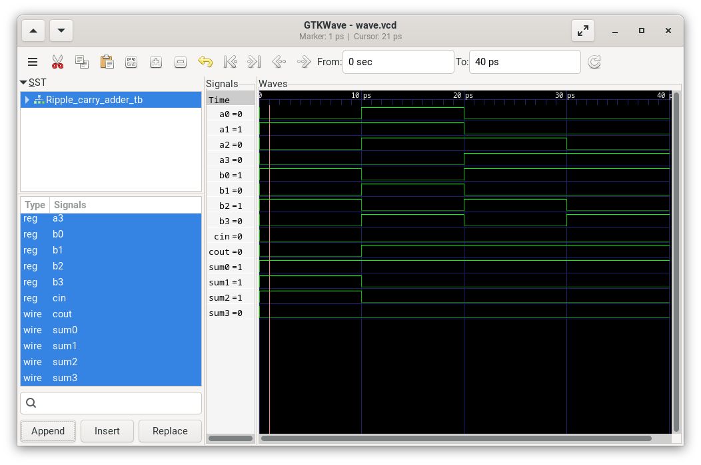

# CPU_BUILD
  

16-bit CPU implemented in Verilog — tested with Icarus Verilog, Vivado and inspected with GTKWave.

This repository is a hands-on project exploring digital logic design and CPU architecture. It contains both small practice modules (gates, multiplexers, adders, RAM blocks) and a main 16-bit CPU design with testbenches and simulation outputs.

## Key points

- Target: 16-bit CPU (primary)
- Language: Verilog
- Simulators / tools used: Icarus Verilog (iverilog + vvp), Xilinx Vivado, GTKWave
- License: MIT



## Quick start (Icarus Verilog)

Compile, run and view a waveform (replace FILE_name with the testbench name without extension):

```bash
iverilog -o FILE_name FILE_name_tb.v
vvp FILE_name
gtkwave wave.vcd
```

Notes:
- Many modules include their own testbenches in `Code/*/*_tb.v` and small test runners in the same directories.
- For Vivado, open the project or create a new one and add source/testbench files; run behavioral simulation and export waveforms to view in GTKWave.

## Repository layout (high level)

Code/
- Contains modules grouped by topic and their test benches. Examples:
  - `ADD16/`, `ALU(hack)/`, `RAM*`, `MUX*/`, `DMUX*`, `HALF_ADDER/`, `FULL_ADDER/`, etc.

Ouputs/
- Waveform screenshots and exported images (used in documentation). Example: `output_ripple_carry_adder.png`.

Other files
- `README.md` — this file
- `LICENSE.md` — MIT license
- `push_script.sh` — personal helper script

## Design notes

- The CPU is built from the ground up using modular Verilog components. Each component has a testbench and many have waveform screenshots saved to `Ouputs/`.
- The design is intended as an educational, extensible project — a clear path exists to expand from 16-bit to 32-bit if desired.

## Roadmap (suggestions)

1. Finalize top-level CPU instruction set and documentation
2. Add a small example program (loader + memory image) and a cycle-accurate simulation script
3. Add CI to run Icarus Verilog testbenches automatically (GitHub Actions)
4. Provide schematic / block diagram (SVG) and a short dev guide for contributors

## How to contribute

- Open an issue to propose changes or fixes
- Send a pull request with a clear description and tests (or a passing testbench)

## Author

_Darkops-cpu_

## License

This project is licensed under the MIT License — see `LICENSE.md` for details.

## Contact

If you'd like to collaborate or have questions, open an issue or add your contact info in the Author section.
